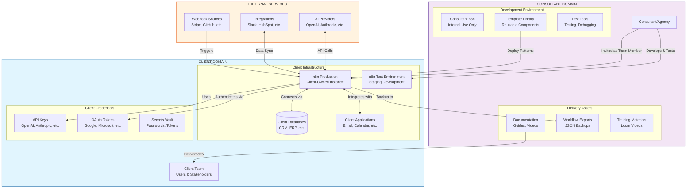
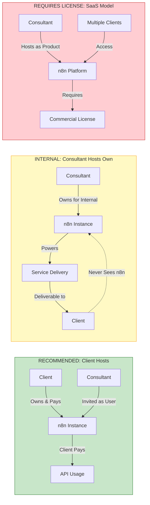
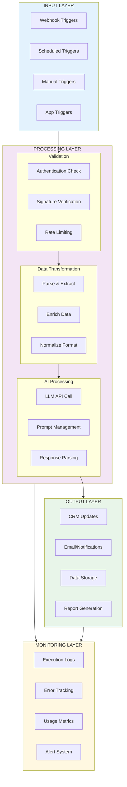
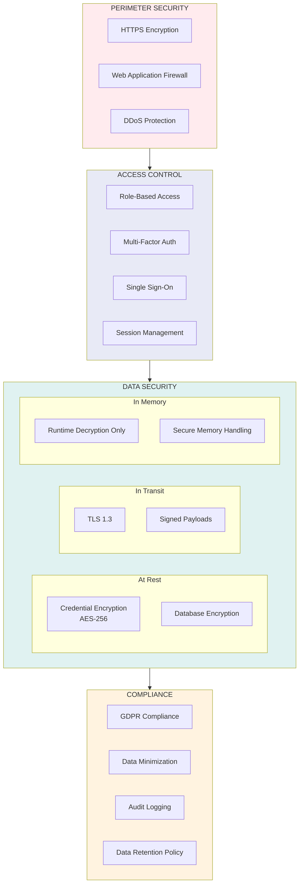
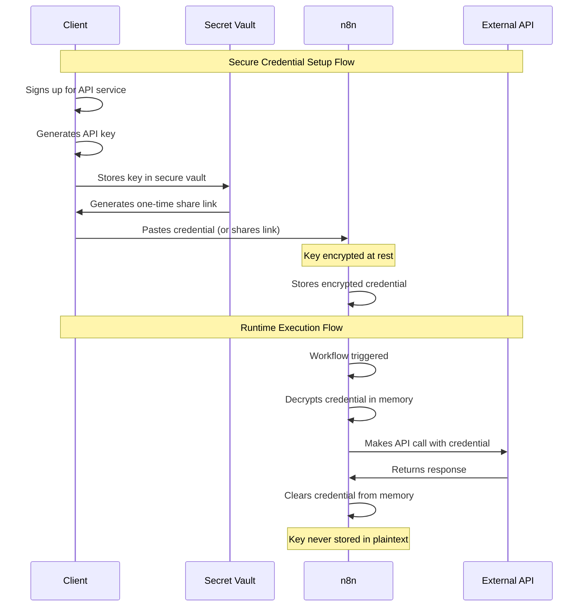
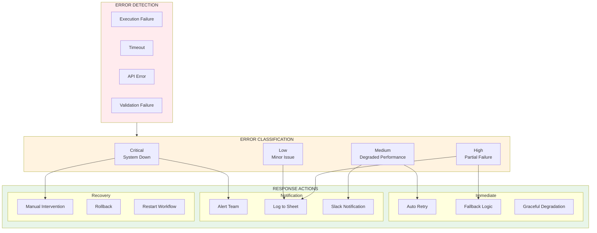
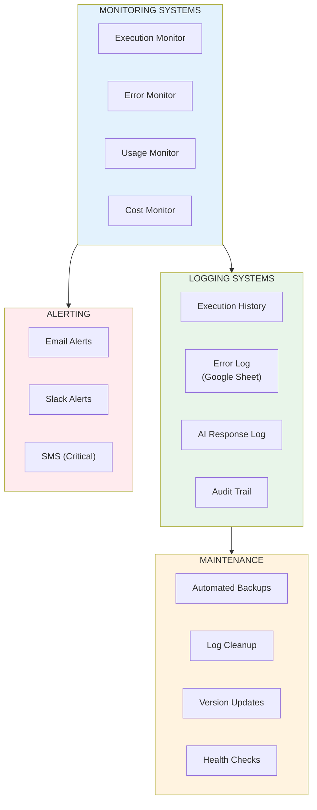

# Master Architecture Diagram
## Complete Workflow Automation Delivery System

---

## 1. High-Level System Architecture

---

## 2. Hosting Models Comparison

---

## 3. Data Flow Architecture

---

## 4. Security Architecture

---

## 5. Project Delivery Pipeline

```mermaid
flowchart LR
    subgraph PHASE1["Phase 1: Discovery"]
        DISCOVERY["Discovery Call"]
        SCOPE["Scope Definition"]
        CONTRACT["Contract Signing"]
    end

    subgraph PHASE2["Phase 2: Setup"]
        KICKOFF["Kickoff Call"]
        ENV_SETUP["Environment Setup"]
        CRED_CONFIG["Credential Config"]
    end

    subgraph PHASE3["Phase 3: Development"]
        BUILD["Build Workflows"]
        INTERNAL_QA["Internal QA"]
        ITERATE["Iterate & Refine"]
    end

    subgraph PHASE4["Phase 4: Testing"]
        CLIENT_TEST["Client Testing"]
        FEEDBACK["Feedback Collection"]
        REFINEMENT["Final Refinements"]
    end

    subgraph PHASE5["Phase 5: Delivery"]
        HANDOVER["Handover"]
        TRAINING["Training"]
        DOCS_DELIVER["Documentation"]
    end

    subgraph PHASE6["Phase 6: Support"]
        GO_LIVE["Go Live"]
        MONITOR["Monitor"]
        MAINTAIN["Maintain"]
    end

    PHASE1 --> PHASE2 --> PHASE3 --> PHASE4 --> PHASE5 --> PHASE6

    style PHASE1 fill:#e3f2fd
    style PHASE2 fill:#e8f5e9
    style PHASE3 fill:#fff3e0
    style PHASE4 fill:#fce4ec
    style PHASE5 fill:#f3e5f5
    style PHASE6 fill:#e0f7fa
```

---

## 6. Credential Flow Architecture

---

## 7. Error Handling & Recovery Architecture

---

## 8. Maintenance & Monitoring Architecture

---

## Architecture Decision Records

### ADR-001: Client-Hosted Infrastructure
**Decision**: Clients host their own n8n instances
**Rationale**:
- Complies with n8n licensing
- Client owns data and credentials
- Clean separation of concerns
- No billing complexity

### ADR-002: Credential Ownership
**Decision**: Clients own and pay for all API credentials
**Rationale**:
- Transparent billing
- No markup disputes
- Client retains control
- Easier handover

### ADR-003: Test/Production Separation
**Decision**: Maintain separate test and production environments
**Rationale**:
- Safe testing without production impact
- Validate updates before deployment
- Professional development practices

---

**Next**: See `02-hosting-decision-tree.md` for detailed hosting decisions.
