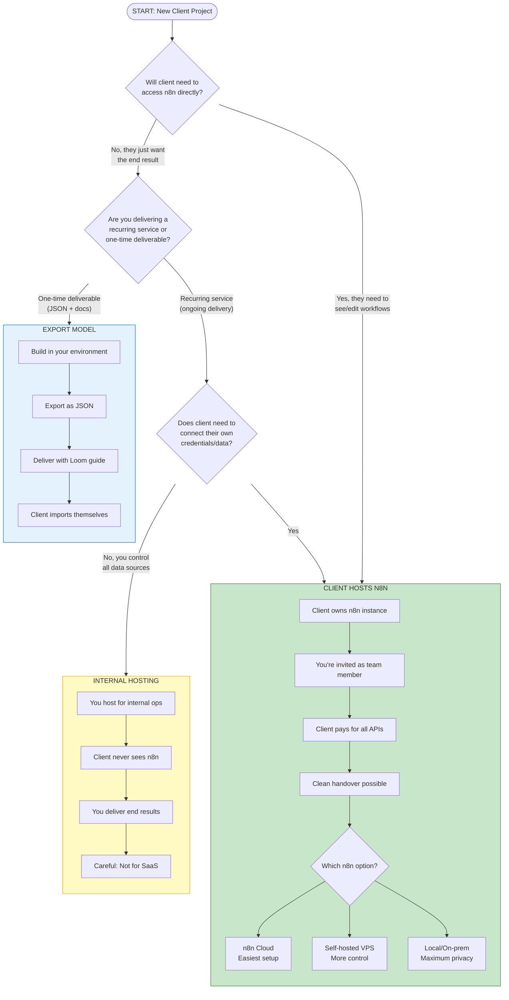
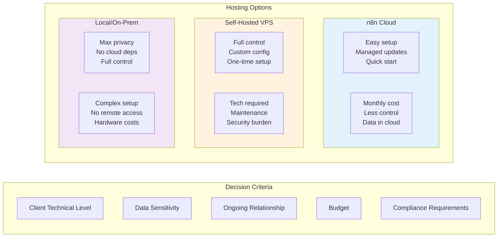
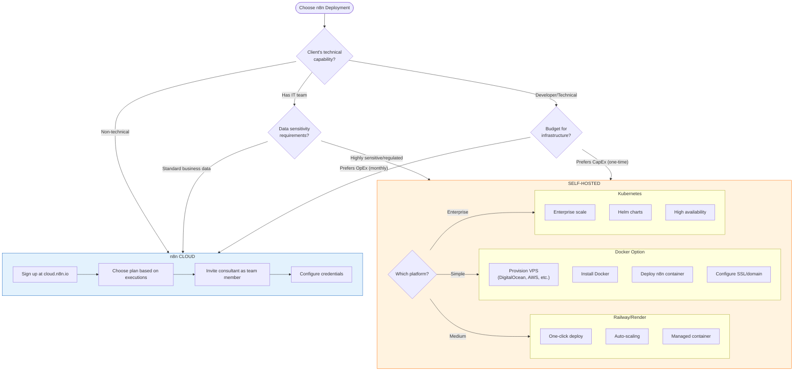
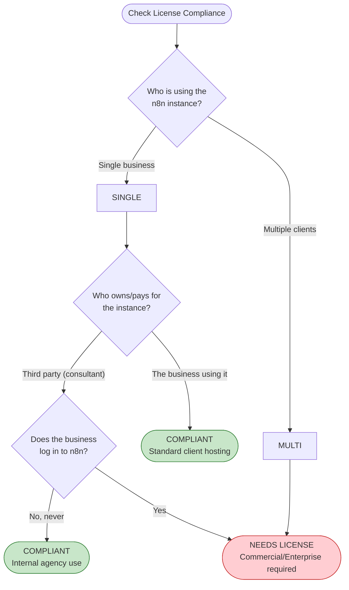
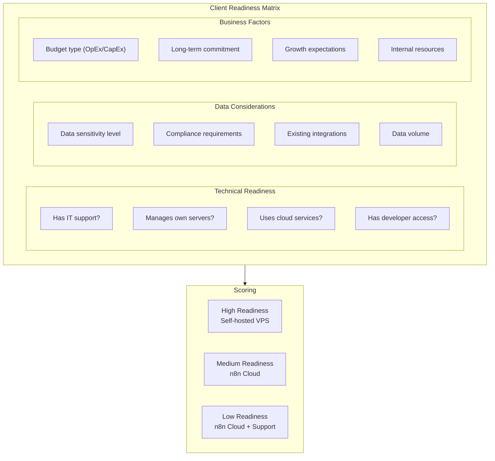
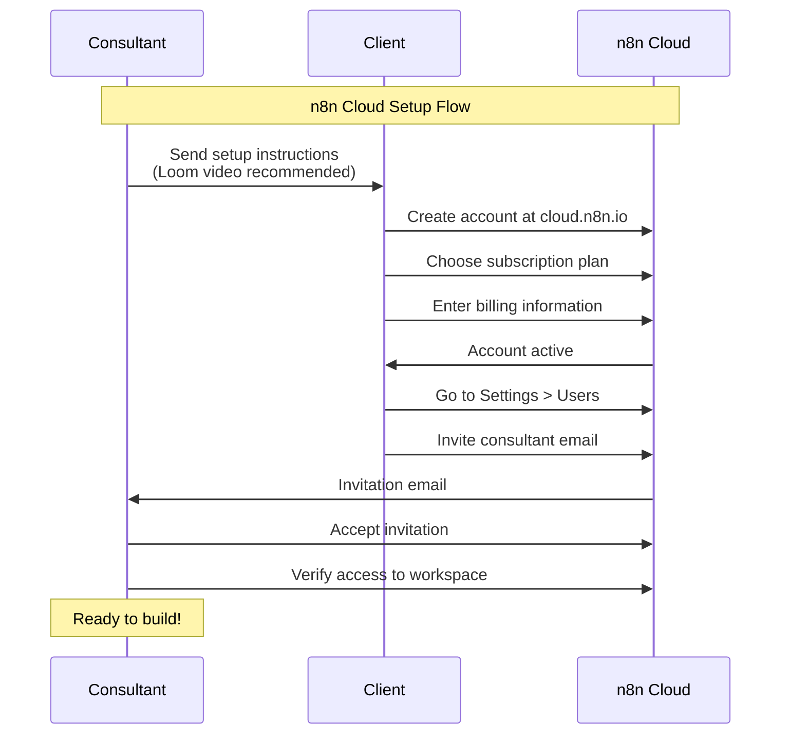
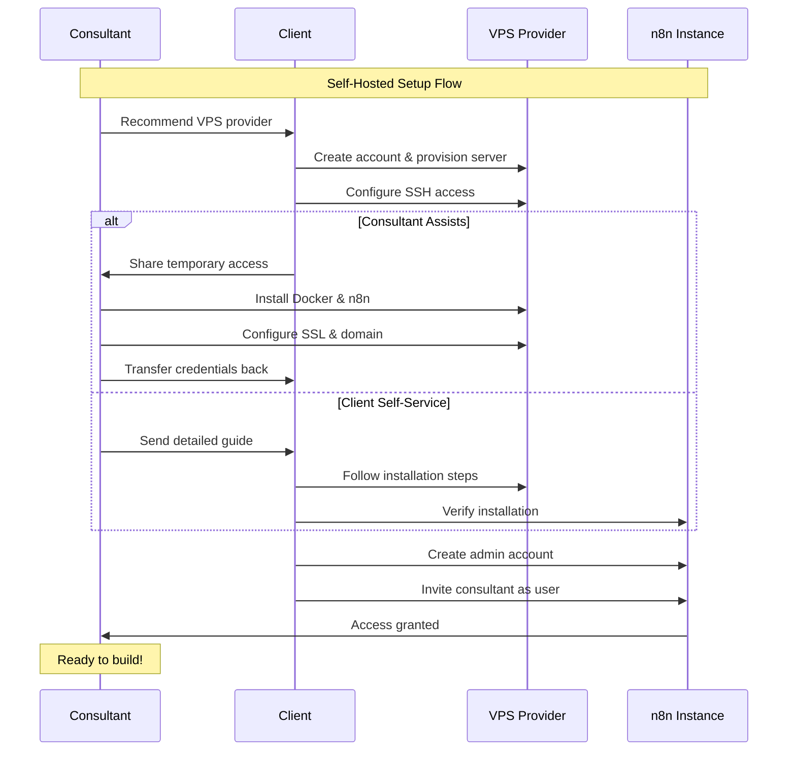
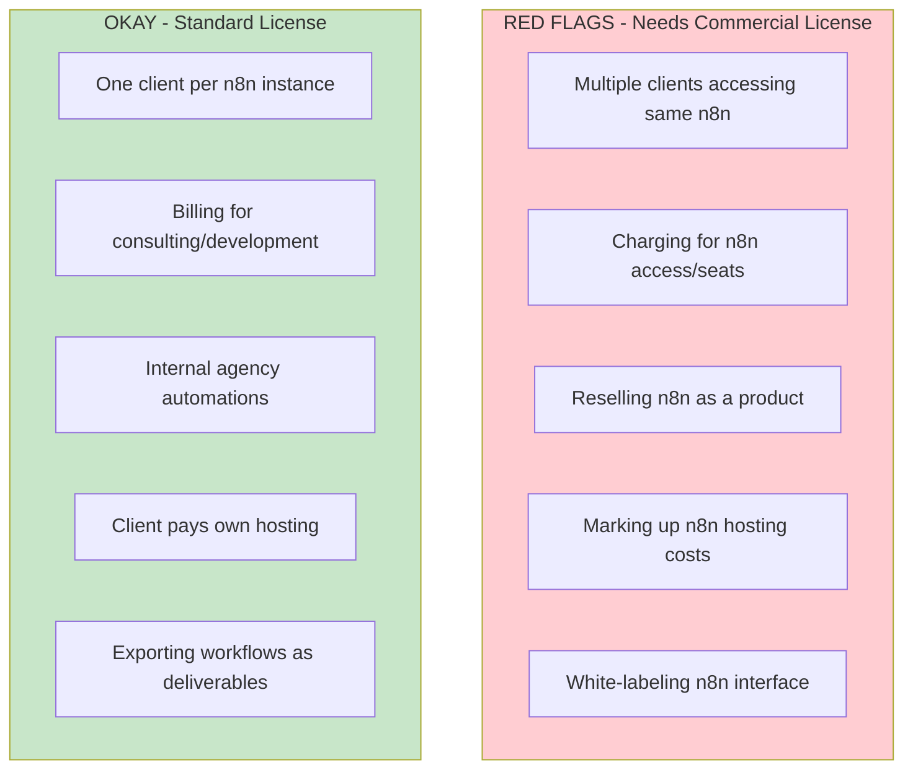

# Hosting Decision Tree
## Choose the Right Hosting Model for Every Client

---

## Primary Decision Flowchart

---

## Detailed Decision Matrix

---

## n8n Cloud vs Self-Hosted Decision

---

## License Compliance Checker

---

## Client Readiness Assessment

---

## Hosting Setup Workflows

### For n8n Cloud Setup

### For Self-Hosted Setup

---

## Quick Reference Table

| Scenario | Recommended Hosting | Licensing | Notes |
|----------|---------------------|-----------|-------|
| Client wants to see/manage workflows | Client hosts (Cloud or VPS) | Standard | Most common |
| Client just wants results delivered | Your internal n8n | Standard | Don't expose n8n |
| Selling workflow as JSON export | Either | Standard | One-time delivery |
| Building SaaS/platform | Your hosting | **Commercial** | Contact n8n sales |
| Enterprise with compliance needs | Client self-hosted | Standard | On-prem option |
| Quick prototype/POC | Your internal | Standard | For testing only |

---

## Red Flags to Watch For

---

**Next**: See `03-project-lifecycle.md` for the complete project delivery flow.
