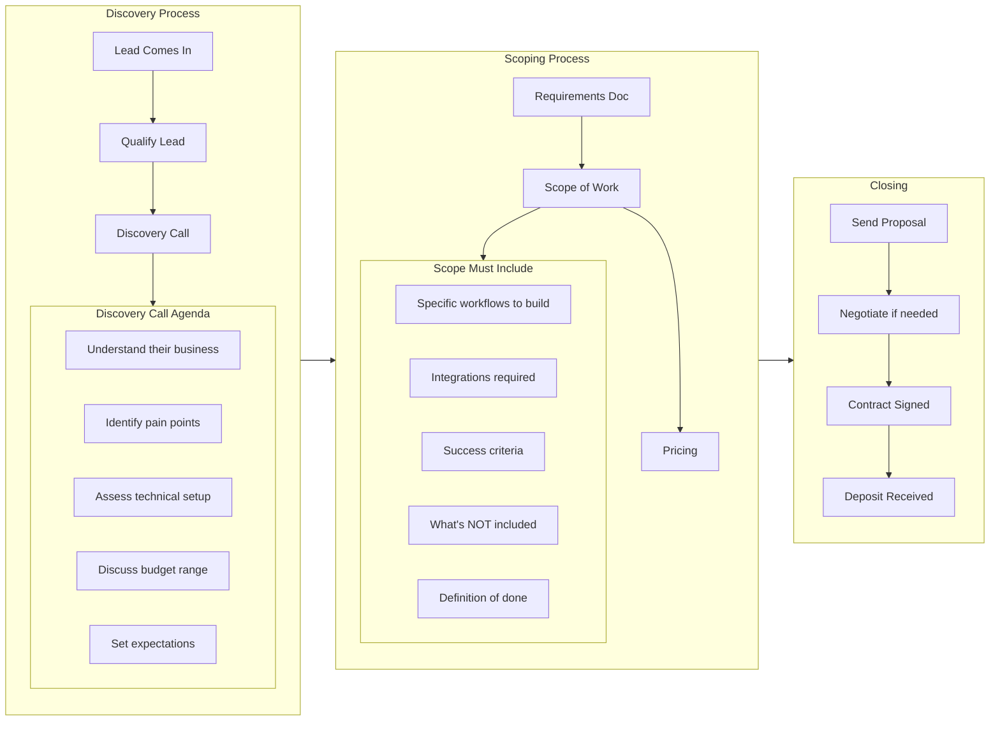
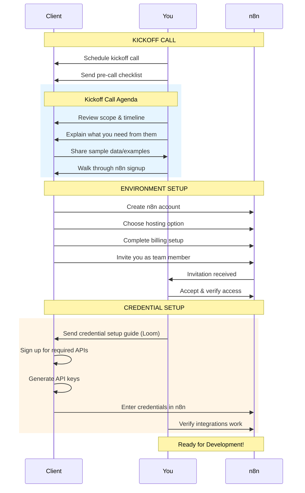
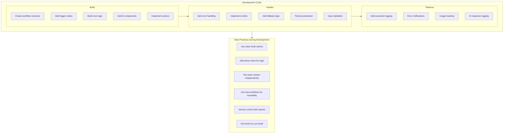
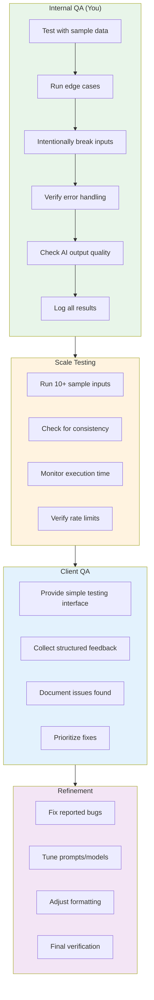
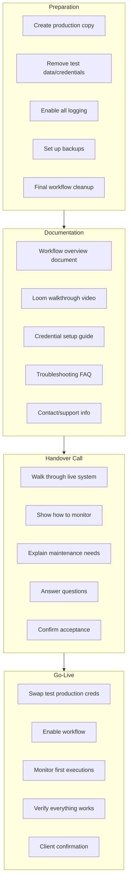
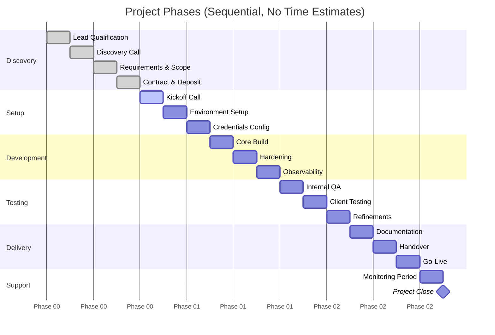
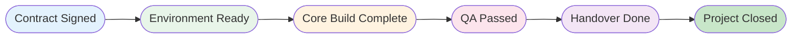

# Project Lifecycle Diagram
## End-to-End Workflow Delivery Journey

---

## Complete Project Lifecycle

```mermaid
flowchart TB
    subgraph PHASE1[" PHASE 1: DISCOVERY & SALES"]
        direction TB
        P1A["Lead Inquiry"] --> P1B["Discovery Call"]
        P1B --> P1C["Requirements Gathering"]
        P1C --> P1D["Scope Definition"]
        P1D --> P1E["Proposal & Pricing"]
        P1E --> P1F["Contract Signing"]
    end

    subgraph PHASE2[" PHASE 2: KICKOFF & SETUP"]
        direction TB
        P2A["Kickoff Call"] --> P2B["Collect Sample Data"]
        P2B --> P2C["Environment Setup"]
        P2C --> P2D["Credential Configuration"]
        P2D --> P2E["Integration Testing"]
    end

    subgraph PHASE3[" PHASE 3: DEVELOPMENT"]
        direction TB
        P3A["Build Core Workflow"] --> P3B["Add Error Handling"]
        P3B --> P3C["Implement AI Components"]
        P3C --> P3D["Add Logging/Monitoring"]
        P3D --> P3E["Internal Testing"]
    end

    subgraph PHASE4[" PHASE 4: TESTING & QA"]
        direction TB
        P4A["Internal QA Pass"] --> P4B["Edge Case Testing"]
        P4B --> P4C["Client Testing"]
        P4C --> P4D["Feedback Collection"]
        P4D --> P4E["Refinements"]
    end

    subgraph PHASE5[" PHASE 5: DELIVERY"]
        direction TB
        P5A["Documentation"] --> P5B["Training Videos"]
        P5B --> P5C["Handover Call"]
        P5C --> P5D["Credential Transfer"]
        P5D --> P5E["Go-Live"]
    end

    subgraph PHASE6[" PHASE 6: SUPPORT"]
        direction TB
        P6A["Monitoring Period"] --> P6B["Bug Fixes"]
        P6B --> P6C["Final Invoice"]
        P6C --> P6D{"Ongoing Retainer?"}
        P6D -->|"Yes"| P6E["Maintenance Mode"]
        P6D -->|"No"| P6F["Project Close"]
    end

    PHASE1 --> PHASE2 --> PHASE3 --> PHASE4 --> PHASE5 --> PHASE6

    style PHASE1 fill:#e3f2fd
    style PHASE2 fill:#e8f5e9
    style PHASE3 fill:#fff3e0
    style PHASE4 fill:#fce4ec
    style PHASE5 fill:#f3e5f5
    style PHASE6 fill:#e0f7fa
```



---

## Phase 1: Discovery & Sales (Detailed)



---

## Phase 2: Kickoff & Setup (Detailed)



---

## Phase 3: Development (Detailed)



---

## Phase 4: Testing & QA (Detailed)



---

## Phase 5: Delivery (Detailed)



---

## Phase 6: Support & Maintenance (Detailed)

```mermaid
flowchart TB
    subgraph POST_LAUNCH[" Post-Launch (First 7 Days)"]
        PL1["Monitor all executions"]
        PL2["Watch for errors"]
        PL3["Be available for questions"]
        PL4["Quick bug fixes"]
    end

    subgraph CLOSURE[" Project Closure"]
        CL1["Review against scope"]
        CL2["Confirm acceptance"]
        CL3["Send final invoice"]
        CL4["Collect testimonial"]
        CL5["Archive project"]
    end

    subgraph RETAINER_DECISION{"Ongoing Retainer?"}
    end

    subgraph RETAINER_YES[" Maintenance Retainer"]
        RY1["Define SLA"]
        RY2["Monthly check-ins"]
        RY3["Proactive monitoring"]
        RY4["Regular updates"]
        RY5["Bug fixes included"]
    end

    subgraph RETAINER_NO[" No Retainer"]
        RN1["Final handover"]
        RN2["Documentation complete"]
        RN3["Support period ends"]
        RN4["Future work = new project"]
    end

    POST_LAUNCH --> CLOSURE --> RETAINER_DECISION
    RETAINER_DECISION -->|"Yes"| RETAINER_YES
    RETAINER_DECISION -->|"No"| RETAINER_NO
```

---

## Timeline Visualization (Without Time Estimates)



---

## Milestone Checkpoints



---

## Phase Exit Criteria

| Phase | Exit Criteria |
|-------|---------------|
| **Discovery** | Contract signed, deposit received, scope document approved |
| **Setup** | n8n access confirmed, all credentials working, integrations tested |
| **Development** | Core workflow functional, error handling in place, logging active |
| **Testing** | Internal QA passed, client testing complete, all critical bugs fixed |
| **Delivery** | Documentation complete, training delivered, client accepts |
| **Support** | Monitoring period complete, final invoice paid, testimonial collected |

---

**Next**: See `04-security-framework.md` for security architecture details.
