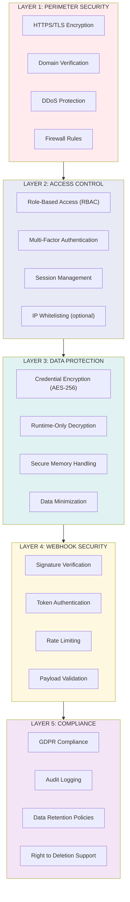
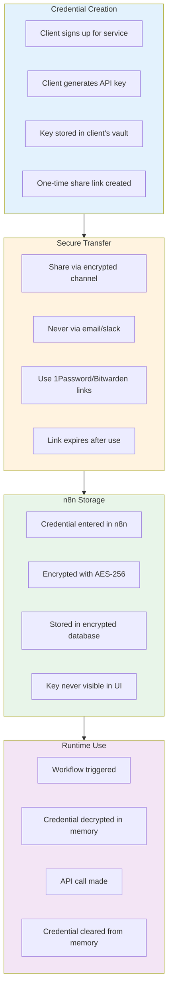
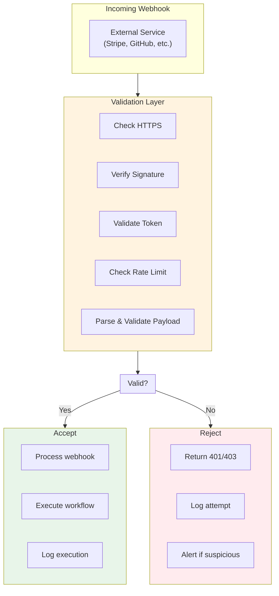
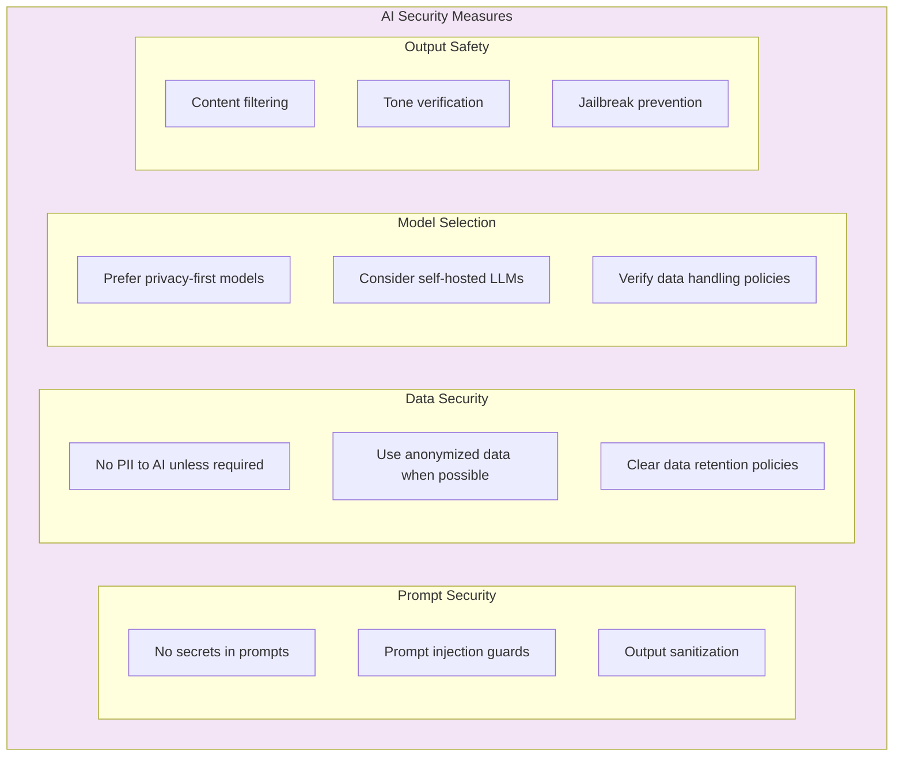
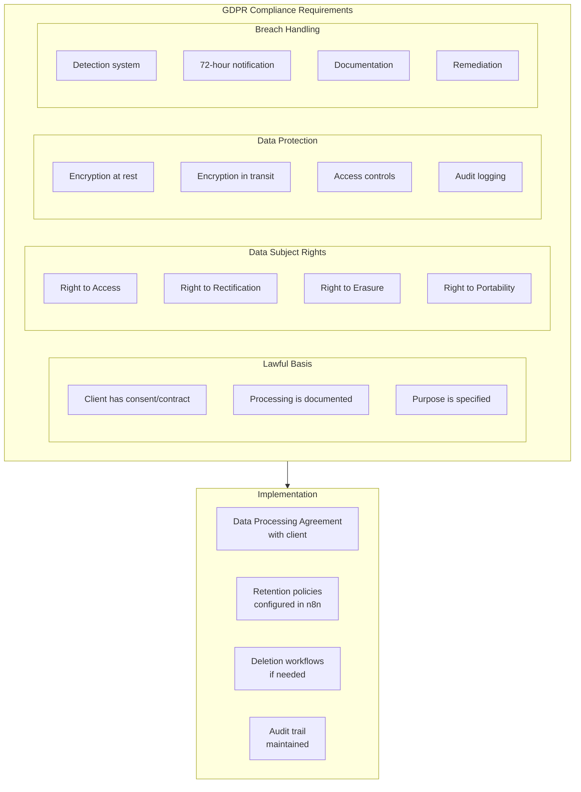
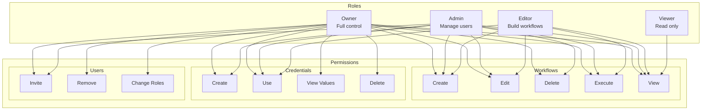
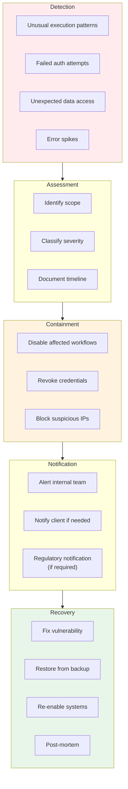

# Security Framework Diagram
## Complete Security Architecture for Workflow Automation Delivery

---

## Security Layers Overview

---

## Credential Security Architecture

---

## Webhook Hardening Architecture

---

## Data Flow Security

```mermaid
flowchart LR
    subgraph SOURCE["Data Sources"]
        S1["CRM Data"]
        S2["Email Content"]
        S3["User Inputs"]
        S4["API Responses"]
    end

    subgraph CLASSIFY["Classification"]
        C1["PII Detection"]
        C2["Sensitivity Level"]
        C3["Retention Rules"]
    end

    subgraph PROCESS[" Processing"]
        P1["Data Minimization<br/>Only needed fields"]
        P2["Encryption in Transit<br/>TLS 1.3"]
        P3["Secure AI Processing<br/>No training on data"]
    end

    subgraph STORE["Storage"]
        ST1["Execution Logs<br/>Auto-prune enabled"]
        ST2["Error Logs<br/>Sensitive data redacted"]
        ST3["AI Logs<br/>For evaluation only"]
    end

    subgraph OUTPUT["Outputs"]
        O1["Actions taken"]
        O2["Notifications sent"]
        O3["Data stored"]
    end

    SOURCE --> CLASSIFY --> PROCESS --> STORE --> OUTPUT

    style CLASSIFY fill:#fff3e0
    style PROCESS fill:#e8f5e9
    style STORE fill:#e3f2fd
```

---

## AI-Specific Security

---

## Compliance Architecture (GDPR Focus)

---

## Access Control Matrix

---

## Security Incident Response

---

## Security Checklist Summary

| Category | Requirement | Priority |
|----------|-------------|----------|
| **Transport** | HTTPS only | Critical |
| **Credentials** | Encrypted at rest | Critical |
| **Webhooks** | Signature verification | High |
| **Access** | RBAC configured | High |
| **Logging** | Audit trail enabled | High |
| **Data** | Minimization practiced | Medium |
| **Compliance** | DPA in place | Medium |
| **AI** | Prompt injection guards | Medium |

---

**Next**: See `05-handover-process.md` for delivery workflow details.
