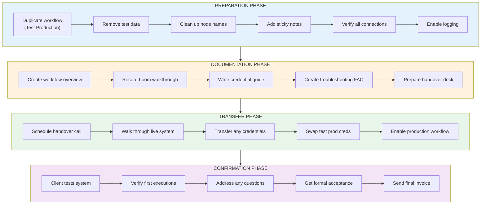
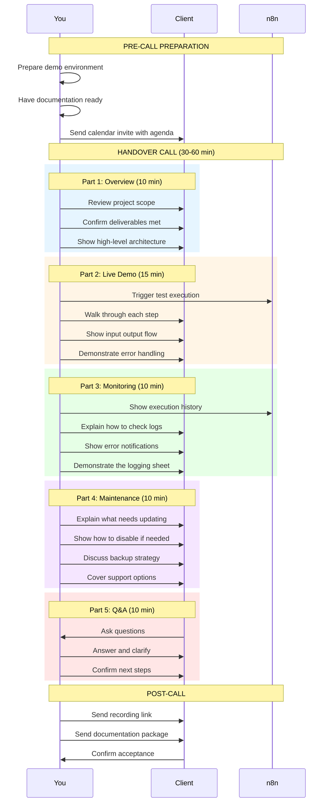
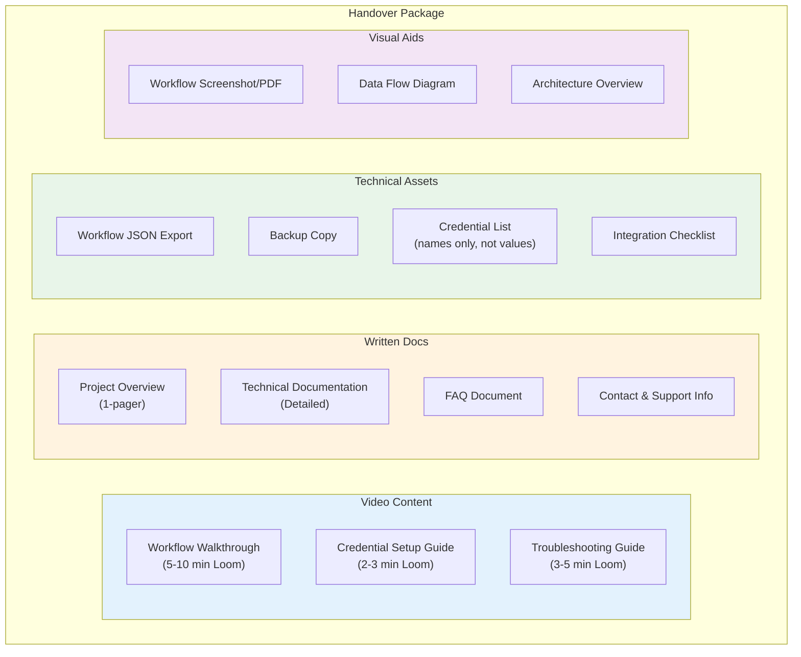
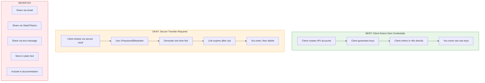
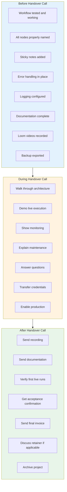
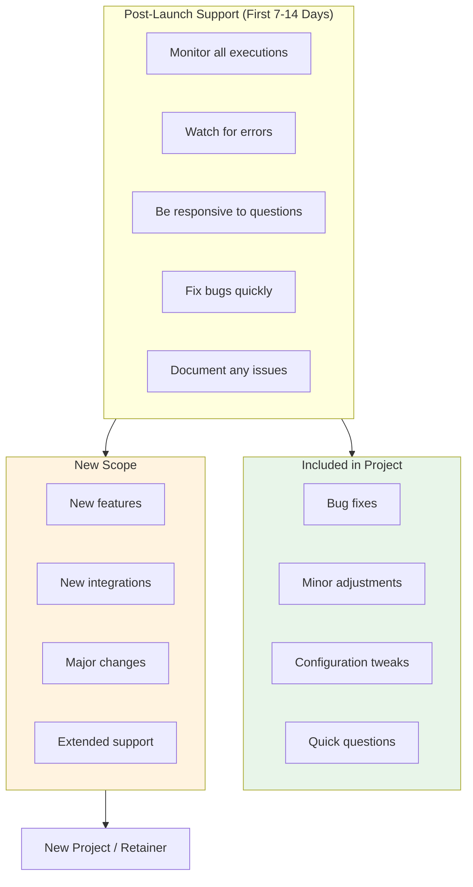

# Handover Process Diagram
## Professional Workflow Delivery & Transfer

---

## Complete Handover Flow



---

## Handover Call Flow



---

## Documentation Package Contents



---

## Credential Transfer Security



---

## Environment Transition

```mermaid
flowchart LR
    subgraph DEV[" Development/Test"]
        DEV_WF["Test Workflow"]
        DEV_CREDS["Test Credentials"]
        DEV_DATA["Sample Data"]
    end

    subgraph HANDOVER[" Handover Actions"]
        H1["Export workflow"]
        H2["Create production copy"]
        H3["Swap credentials"]
        H4["Remove test data"]
        H5["Enable workflow"]
    end

    subgraph PROD[" Production"]
        PROD_WF["Production Workflow"]
        PROD_CREDS["Production Credentials"]
        PROD_DATA["Live Data"]
    end

    DEV --> HANDOVER --> PROD

    style DEV fill:#fff3e0
    style HANDOVER fill:#e3f2fd
    style PROD fill:#e8f5e9
```



---

## Handover Checklist Visualization



---

## Acceptance Criteria Flow

```mermaid
flowchart TB
    subgraph REVIEW[" Review Against Scope"]
        R1["Check each deliverable"]
        R2["Verify success criteria"]
        R3["Confirm integrations work"]
        R4["Validate outputs"]
    end

    subgraph DECISION{"All Criteria Met?"}
    end

    subgraph ACCEPTED[" ACCEPTED"]
        A1["Client signs off"]
        A2["Final invoice sent"]
        A3["Project closes"]
    end

    subgraph NOT_ACCEPTED[" NOT YET"]
        N1["Document gaps"]
        N2["Agree on fixes"]
        N3["Timeline for completion"]
        N4["Return to development"]
    end

    REVIEW --> DECISION
    DECISION -->|"Yes"| ACCEPTED
    DECISION -->|"No"| NOT_ACCEPTED
    NOT_ACCEPTED --> REVIEW

    style ACCEPTED fill:#e8f5e9
    style NOT_ACCEPTED fill:#fff3e0
```

---

## Post-Handover Support Period



---

## Handover Communication Templates

### Pre-Handover Email
```
Subject: Handover Call Scheduled - [Project Name]

Hi [Client],

Your workflow is ready for handover! Here's what to expect:

Call: [Date/Time]
Duration: 30-45 minutes

AGENDA:
1. Project overview & deliverables review
2. Live demo of the workflow
3. Monitoring & logging walkthrough
4. Maintenance & support discussion
5. Q&A

BEFORE THE CALL:
- Have access to your n8n instance
- Be ready to test after we go live

See you soon!
```

### Post-Handover Email
```
Subject: Handover Complete - [Project Name] Documentation

Hi [Client],

Great call! Here's everything you need:

VIDEOS:
- Workflow Walkthrough: [link]
- Credential Setup: [link]

 DOCUMENTATION:
- Project Overview: [link]
- Technical Docs: [link]
- FAQ: [link]

BACKUPS:
- Workflow Export: [link]

NEXT STEPS:
1. Review the documentation
2. Let me know if you have questions
3. I'll monitor for the next [X] days

The workflow is now live and running!
```

---

**Next**: See `06-maintenance-cycle.md` for ongoing support details.
