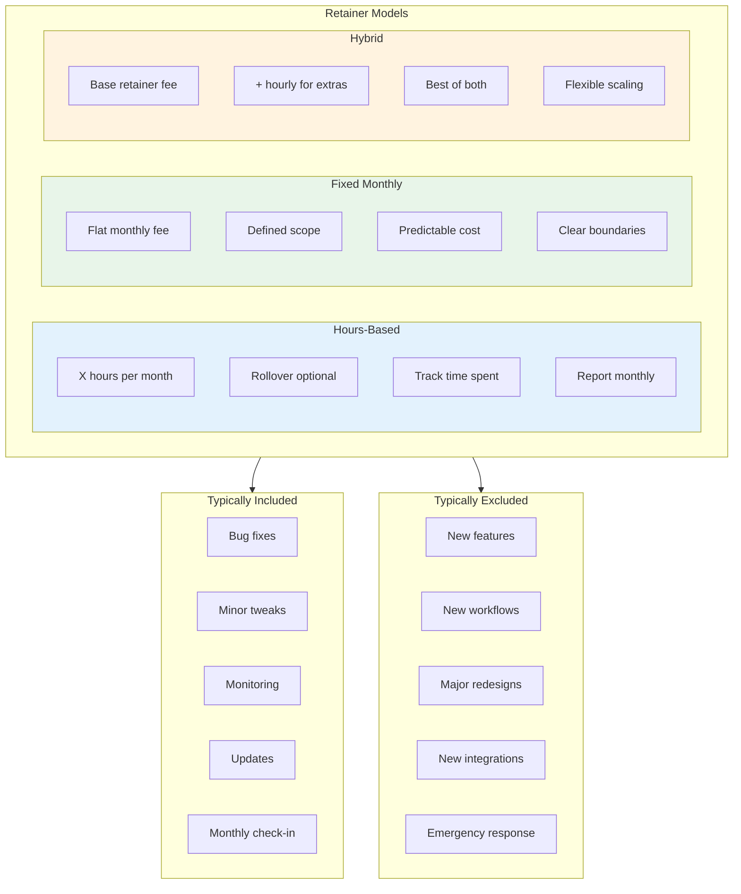
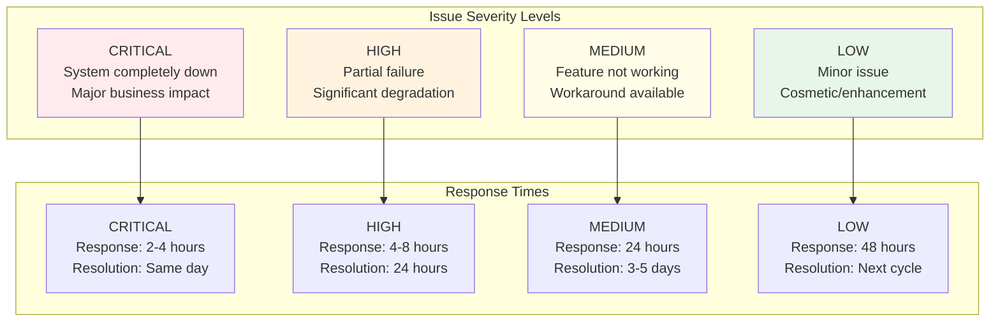
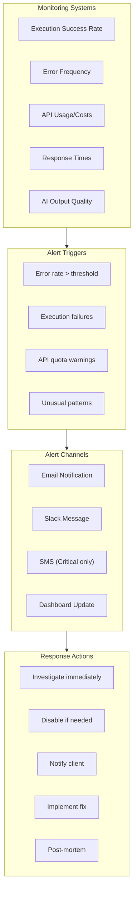
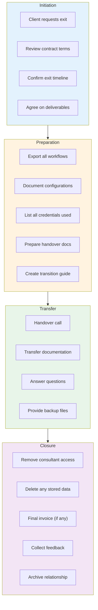
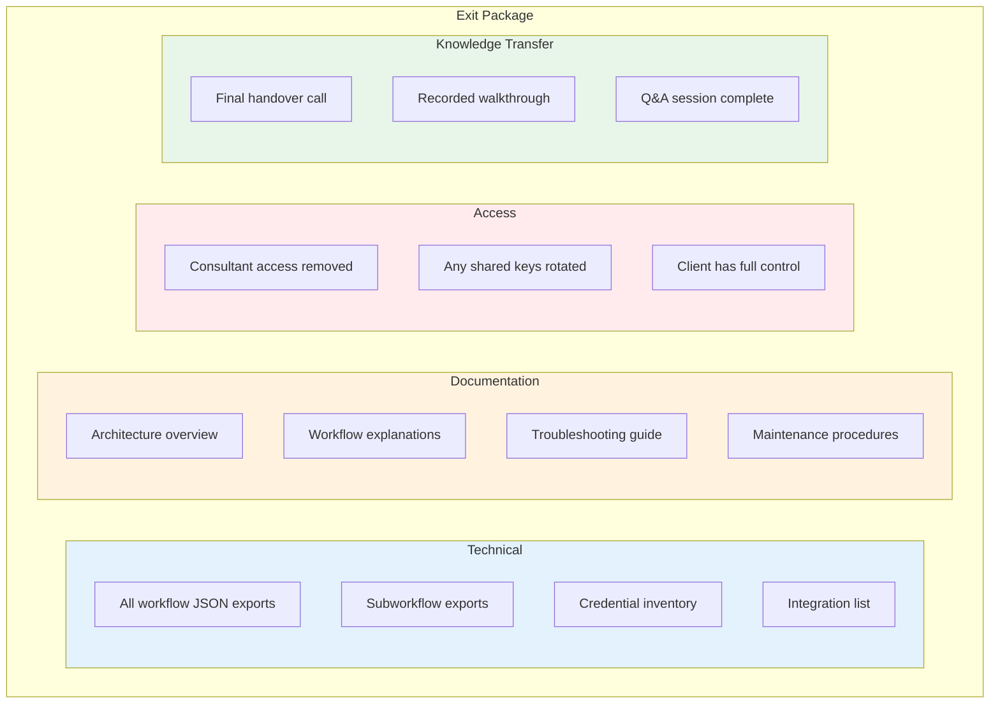
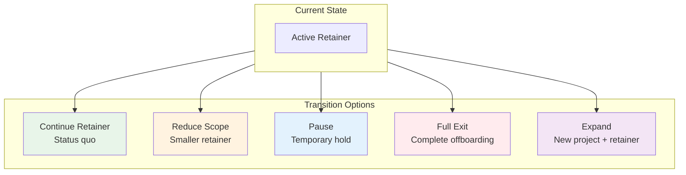
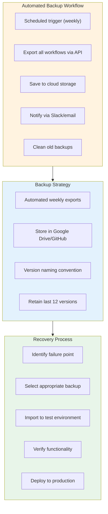

# Maintenance & Support Cycle Diagram
## Ongoing Operations, Retainers & Offboarding

---

## Maintenance Lifecycle Overview

```mermaid
flowchart TB
    subgraph ACTIVE[" ACTIVE MAINTENANCE"]
        direction TB
        A1["Proactive Monitoring"]
        A2["Regular Check-ins"]
        A3["Bug Fixes"]
        A4["Minor Updates"]
        A5["Security Patches"]

        A1 --> A2 --> A3 --> A4 --> A5
    end

    subgraph REACTIVE[" REACTIVE SUPPORT"]
        direction TB
        R1["Client Reports Issue"]
        R2["Diagnose Problem"]
        R3["Implement Fix"]
        R4["Verify Solution"]
        R5["Document Resolution"]

        R1 --> R2 --> R3 --> R4 --> R5
    end

    subgraph UPGRADE[" UPGRADES & CHANGES"]
        direction TB
        U1["New Feature Request"]
        U2["Scope as New Project"]
        U3["Quote & Approve"]
        U4["Develop & Test"]
        U5["Deploy to Production"]

        U1 --> U2 --> U3 --> U4 --> U5
    end

    subgraph OFFBOARD[" OFFBOARDING"]
        direction TB
        O1["Exit Request"]
        O2["Transition Plan"]
        O3["Knowledge Transfer"]
        O4["Final Handover"]
        O5["Relationship Close"]

        O1 --> O2 --> O3 --> O4 --> O5
    end

    ACTIVE --> REACTIVE
    REACTIVE --> UPGRADE
    UPGRADE --> OFFBOARD

    style ACTIVE fill:#e8f5e9
    style REACTIVE fill:#fff3e0
    style UPGRADE fill:#e3f2fd
    style OFFBOARD fill:#ffebee
```



---

## Retainer Structure Options



---

## SLA (Service Level Agreement) Framework



---

## Monitoring & Alerting Flow



---

## Monthly Maintenance Cycle

```mermaid
flowchart LR
    subgraph WEEK1["Week 1"]
        W1A["Review execution logs"]
        W1B["Check error rates"]
        W1C["Verify all workflows active"]
    end

    subgraph WEEK2["Week 2"]
        W2A["Check API usage"]
        W2B["Review costs"]
        W2C["Security audit"]
    end

    subgraph WEEK3["Week 3"]
        W3A["Apply updates if needed"]
        W3B["Test after updates"]
        W3C["Document changes"]
    end

    subgraph WEEK4["Week 4"]
        W4A["Client check-in call"]
        W4B["Monthly report"]
        W4C["Plan next month"]
    end

    WEEK1 --> WEEK2 --> WEEK3 --> WEEK4

    style WEEK1 fill:#e3f2fd
    style WEEK2 fill:#e8f5e9
    style WEEK3 fill:#fff3e0
    style WEEK4 fill:#f3e5f5
```



---

## Update & Upgrade Process

```mermaid
flowchart TB
    subgraph TRIGGER["Update Trigger"]
        T1["n8n version update"]
        T2["Integration API change"]
        T3["Security patch needed"]
        T4["Client feature request"]
    end

    subgraph PROCESS[" Update Process"]
        P1["Apply update to TEST env"]
        P2["Load all workflows"]
        P3["Run comprehensive tests"]
        P4["Verify functionality"]
        P5["Document any changes"]
    end

    subgraph DECISION{"All Tests Pass?"}
    end

    subgraph DEPLOY[" Deploy"]
        D1["Schedule maintenance window"]
        D2["Apply to PRODUCTION"]
        D3["Monitor closely"]
        D4["Notify client"]
    end

    subgraph ROLLBACK[" Rollback"]
        R1["Identify issues"]
        R2["Wait for fix"]
        R3["Or revert to backup"]
    end

    TRIGGER --> PROCESS --> DECISION
    DECISION -->|"Yes"| DEPLOY
    DECISION -->|"No"| ROLLBACK
    ROLLBACK --> PROCESS

    style DEPLOY fill:#e8f5e9
    style ROLLBACK fill:#ffebee
```

---

## Offboarding Process



---

## Offboarding Deliverables Checklist



---

## Relationship Transition Options



---

## Backup & Recovery Strategy



---

## Monthly Report Template

```
+==============================================================+
|                    MONTHLY MAINTENANCE REPORT                |
+==============================================================+
| Client: [Name]                    Period: [Month Year]       |
+==============================================================+

 EXECUTION SUMMARY
|-- Total Executions: [X]
|-- Successful: [X] ([X]%)
|-- Failed: [X] ([X]%)
+-- Avg Execution Time: [X]s

 API USAGE & COSTS
|-- OpenAI Tokens: [X]
|-- Estimated Cost: $[X]
+-- Trend: [up/down/stable] vs last month

 ISSUES & RESOLUTIONS
|-- Issues Reported: [X]
|-- Issues Resolved: [X]
+-- Outstanding: [X]

 UPDATES APPLIED
|-- n8n Updates: [Yes/No]
|-- Workflow Changes: [List]
+-- Security Patches: [Yes/No]

 RECOMMENDATIONS
|-- [Recommendation 1]
|-- [Recommendation 2]
+-- [Recommendation 3]

 NEXT MONTH PLAN
|-- [Planned action 1]
|-- [Planned action 2]
+-- [Planned action 3]

+==============================================================+
```

---

**Next**: See `checklists/01-master-checklist.md` for comprehensive checklists.
