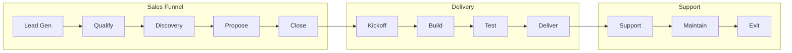

# Standard Operating Procedures (SOPs)
## Master Index for All Team Roles

---

## Overview

This document indexes all Standard Operating Procedures for the Workflow Automation Delivery team. Each role has specific responsibilities and procedures to follow.

---

## Role Definitions

```
┌─────────────────────────────────────────────────────────────────────────────┐
│                          TEAM STRUCTURE                                     │
├─────────────────────────────────────────────────────────────────────────────┤
│                                                                             │
│  SALES FUNNEL                      DELIVERY TEAM                           │
│  ────────────                      ─────────────                           │
│  ┌─────────────┐                   ┌─────────────┐                         │
│  │ Lead Gen VA │ ──────────────────│ Project     │                         │
│  │             │                   │ Manager     │                         │
│  └──────┬──────┘                   └──────┬──────┘                         │
│         │                                 │                                 │
│         ▼                                 │                                 │
│  ┌─────────────┐                          │                                 │
│  │ Sales Rep   │                          │                                 │
│  │             │                          │                                 │
│  └──────┬──────┘                          │                                 │
│         │                                 │                                 │
│         ▼                                 ▼                                 │
│  ┌─────────────┐                   ┌─────────────┐                         │
│  │ Closer      │ ─────────────────▶│ Technical   │                         │
│  │             │                   │ Lead        │                         │
│  └─────────────┘                   └──────┬──────┘                         │
│                                           │                                 │
│                                           ▼                                 │
│                                    ┌─────────────┐                         │
│                                    │ Developer   │                         │
│                                    │             │                         │
│                                    └──────┬──────┘                         │
│                                           │                                 │
│                                           ▼                                 │
│                                    ┌─────────────┐                         │
│                                    │ Client      │                         │
│                                    │             │                         │
│                                    └─────────────┘                         │
│                                                                             │
└─────────────────────────────────────────────────────────────────────────────┘
```

---

## SOP Document Index

| Role | Document | Purpose |
|------|----------|---------|
| Lead Gen VA | `01-sop-lead-gen-va.md` | Lead sourcing, qualification, outreach |
| Sales Representative | `02-sop-sales-rep.md` | Discovery, relationship building |
| Closer | `03-sop-closer.md` | Proposals, negotiations, contracts |
| Project Manager | `04-sop-project-manager.md` | Coordination, communication, timeline |
| Technical Lead | `05-sop-technical-lead.md` | Architecture, oversight, quality |
| Developer | `06-sop-developer.md` | Building, testing, documentation |
| Client | `07-sop-client.md` | What clients need to do |

---

## Handoff Matrix

```
WHO HANDS OFF TO WHOM:

Lead Gen VA        Sales Rep        : Qualified lead with initial info
Sales Rep          Closer           : Warm prospect ready for proposal
Closer             Project Manager  : Signed contract, deposit paid
Project Manager    Technical Lead   : Kickoff complete, requirements gathered
Technical Lead     Developer        : Architecture approved, tasks assigned
Developer          Technical Lead   : Work complete for review
Technical Lead     Project Manager  : QA passed, ready for handover
Project Manager    Client           : Handover call, documentation delivered
```

---

## Process Stages



---

## Quick Reference: Who Does What

### Sales Phase
| Task | Primary Owner | Support |
|------|---------------|---------|
| Find leads | Lead Gen VA | - |
| Initial outreach | Lead Gen VA | - |
| Respond to inquiries | Sales Rep | - |
| Discovery calls | Sales Rep | Closer |
| Proposals | Closer | Sales Rep |
| Negotiations | Closer | - |
| Contract signing | Closer | - |

### Delivery Phase
| Task | Primary Owner | Support |
|------|---------------|---------|
| Project coordination | Project Manager | - |
| Client communication | Project Manager | Technical Lead |
| Technical decisions | Technical Lead | Developer |
| Building workflows | Developer | Technical Lead |
| Testing | Developer | Technical Lead |
| Documentation | Developer | Project Manager |
| Handover call | Project Manager | Technical Lead |

### Support Phase
| Task | Primary Owner | Support |
|------|---------------|---------|
| Support period | Developer | Project Manager |
| Retainer work | Developer | Technical Lead |
| Client check-ins | Project Manager | - |
| Invoicing | Project Manager | - |
| Offboarding | Project Manager | Developer |

---

## Escalation Paths

```
ISSUE TYPE                ESCALATE TO
─────────────────────────────────────────────────
Sales issues              Closer  Sales Manager
Technical blockers        Technical Lead  Agency Owner
Client complaints         Project Manager  Agency Owner
Payment issues            Project Manager  Finance/Owner
Security incidents        Technical Lead  Agency Owner  Legal
Contract disputes         Agency Owner  Legal
```

---

## Communication Standards

### Response Times

| Communication | Expected Response |
|---------------|-------------------|
| Client email (normal) | 24 hours |
| Client email (urgent) | 4 hours |
| Internal Slack | 2 hours |
| Critical issues | 30 minutes |

### Documentation Standards

All documentation must include:
- Date created/updated
- Author
- Version number
- Clear headings
- Action items highlighted

---

## Training Path

```
NEW TEAM MEMBER ONBOARDING:

Week 1: Framework Overview
- Read all SOP documents
- Review sample projects
- Shadow experienced team member

Week 2: Role-Specific Training
- Deep dive on role SOP
- Practice scenarios
- Tool training

Week 3: Supervised Practice
- Handle real tasks with oversight
- Daily check-ins
- Feedback sessions

Week 4+: Independent Work
- Full responsibility
- Weekly check-ins
- Ongoing development
```

---

**Next**: See individual SOP documents for role-specific procedures.
